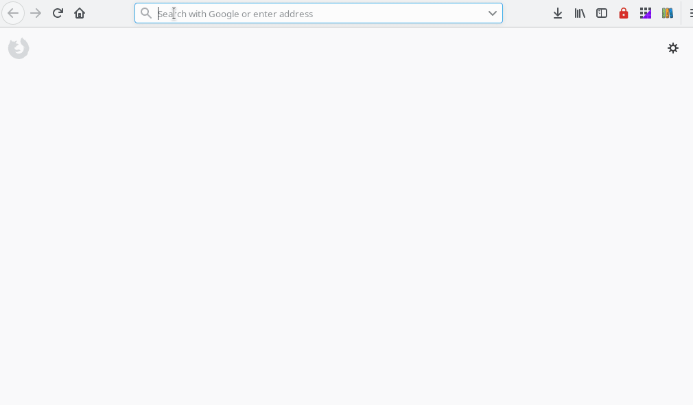

# GitHub's Code Collapse

**Download For:**
[ Firefox](https://addons.mozilla.org/firefox/addon/github-code-collapse/) (other browsers pending)

## About

A simple, dev-friendly extension that will turn the code content area of github.com repository into a toggable section.

Code area is collapsed by default.

## More niceties

Find additional GitHub-related extensions at https://github.com/stefanbuck/awesome-browser-extensions-for-github.
